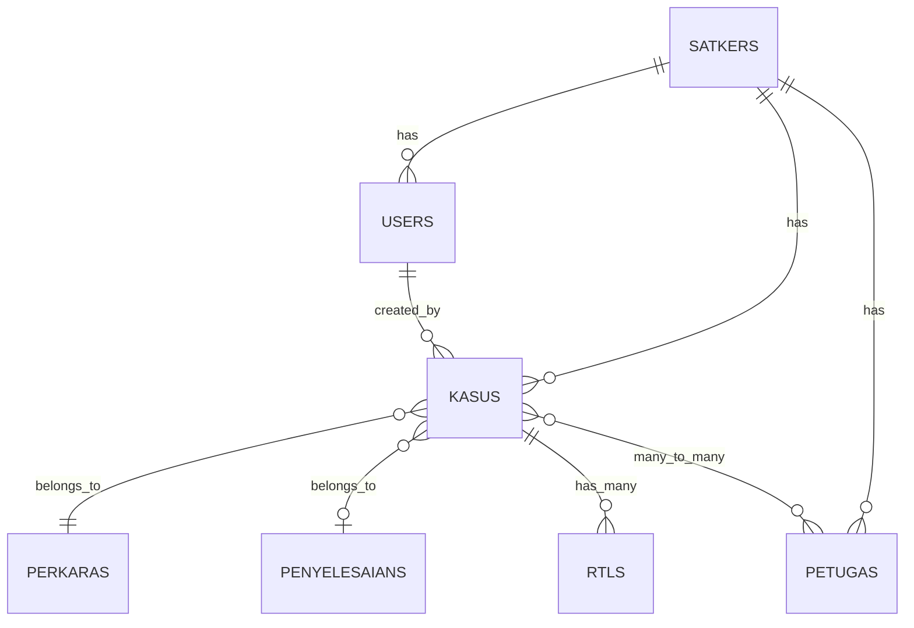

# Monitoring Penanganan Laporan Polisi - Ditres PPA PPO

Web app monitoring status kasus untuk admin tiap satker/satwil dan pimpinan di Direktorat PPA PPO.

## Requirements Summary

| Aspect | Detail |
|---|---|
| **Tech** | Laravel 11 + **Filament v3** (admin panel) |
| **DB** | MySQL atau SQLite (configurable via `.env`) |
| **Auth** | 3 roles: `super_admin`, `admin`, `atasan` |
| **Satker** | 3 Subdit + 8 Polres = 11 awal (dinamis) |
| **Deploy** | VPS / Shared hosting + cPanel (tanpa Docker) |

### Kenapa Filament?

Filament v3 menyediakan:
- Admin panel siap pakai dengan UI modern (Tailwind-based)
- CRUD Resources otomatis (form builder + table builder)
- Dashboard widgets untuk summary table
- Built-in import/export actions
- Auth & role management terintegrasi
- Tidak perlu menulis Blade views manual untuk CRUD

### Roles & Permissions

| Role | Baca Semua Data | Kelola Data | Kelola Master | Kelola User |
|---|---|---|---|---|
| Super Admin | ✅ | ✅ (semua satker) | ✅ | ✅ |
| Admin | ❌ (hanya satkernya) | ✅ (hanya satkernya) | ❌ | ❌ |
| Atasan | ✅ | ❌ (read-only) | ❌ | ❌ |

### Data Kasus

| Field | Type | Keterangan |
|---|---|---|
| Nomor LP | text | Nomor laporan polisi |
| Tanggal LP | date | Tanggal laporan |
| Nama Korban | text | |
| Tempat Lahir Korban | text | Tempat lahir |
| Tanggal Lahir Korban | date | Tanggal lahir |
| Alamat Korban | text | |
| No HP Korban | text | |
| Perkara | select (CRUD-able) | TPKS, Pemerkosaan, Perzinaan, TPPO, dll |
| RTL | has-many (timeline) | Tiap entry: tanggal + keterangan |
| Dokumen/Giat | select (fixed) | Lidik / Sidik |
| Petugas | multi-select | 1 atau lebih petugas |
| Penyelesaian | select (CRUD-able, nullable) | P21, Henti Lidik, SP3, Diversi, RJ, dll |

---

## Proposed Changes

### 1. Project Initialization

#### [NEW] Laravel Project at `/home/rick/.gemini/antigravity/scratch/monitoring-ppa`

```bash
composer create-project laravel/laravel monitoring-ppa
cd monitoring-ppa
composer require filament/filament
php artisan filament:install --panels
composer require maatwebsite/excel barryvdh/laravel-dompdf
```

- Configure `.env` untuk database
- Filament panel config di `app/Providers/Filament/AdminPanelProvider.php`

---

### 2. Database Schema

#### [NEW] Migrations

```
satkers         → id, nama, tipe (subdit/polres), kode, timestamps
users           → + role (enum: super_admin/admin/atasan), satker_id (FK nullable)
perkaras        → id, nama, is_active, timestamps
penyelesaians   → id, nama, is_active, timestamps
petugas         → id, satker_id (FK), nama, nrp, pangkat, no_hp, timestamps
kasus           → id, satker_id (FK), nomor_lp, tanggal_lp,
                   nama_korban, tempat_lahir_korban, tanggal_lahir_korban,
                   alamat_korban, hp_korban,
                   perkara_id (FK), dokumen_status (enum: lidik/sidik),
                   penyelesaian_id (FK nullable),
                   created_by (FK users), timestamps
kasus_petugas   → kasus_id, petugas_id (pivot table)
rtls            → id, kasus_id (FK), tanggal, keterangan, timestamps
```

#### ER Diagram



#### [NEW] Seeders

**11 Satker awal:** Subdit 1 Perempuan, Subdit 2 Anak, Subdit 3 TPPO, Polres Lombok Barat/Tengah/Timur, Polres KSB, Polres Sumbawa, Polres Dompu, Polres Bima, Polres Bima Kota

**Perkara:** TPKS, Pemerkosaan, Perzinaan, TPPO

**Penyelesaian:** P21, Henti Lidik, SP3, Diversi, RJ

**Users:** 1 super_admin, 1 atasan, 11 admin (satu per satker)

---

### 3. Filament Resources (CRUD)

Setiap resource otomatis mendapatkan halaman List, Create, Edit, View.

#### [NEW] `KasusResource`
- **Table columns**: No, Nomor LP, Tgl LP, Korban, Perkara, RTL (latest), Dokumen/Giat, Petugas, Penyelesaian
- **Form**: semua field kasus + repeater untuk RTL + multi-select petugas
- **Filters**: satker, perkara, dokumen_status, penyelesaian
- **Scoping**: admin hanya melihat data satkernya, atasan read-only
- **View page**: detail lengkap + RTL timeline
- **Relation Manager**: `RtlRelationManager` (CRUD RTL di halaman detail kasus)

#### [NEW] `PetugasResource`
- CRUD petugas, scoped per satker untuk admin
- Kolom: Nama, NRP, Pangkat, No HP, Satker

#### [NEW] `PerkaraResource` (super_admin only)
- CRUD opsi perkara (nama + is_active toggle)

#### [NEW] `PenyelesaianResource` (super_admin only)
- CRUD opsi penyelesaian (nama + is_active toggle)

#### [NEW] `SatkerResource` (super_admin only)
- CRUD satker (nama, tipe, kode)

#### [NEW] `UserResource` (super_admin only)
- CRUD user + assign role & satker

---

### 4. Dashboard & Widgets

#### [NEW] `SummaryTableWidget`
- Tabel summary auto-aggregated per satker (seperti gambar referensi)
- Kolom: Unit Kerja, Jumlah, Lidik, Sidik, Henti Lidik, P21, SP3, Diversi, RJ, Limpah
- Row terakhir: total keseluruhan
- Color-coded headers (merah=jumlah, biru=proses, hijau=penyelesaian)

#### [NEW] `StatsOverviewWidget`
- Total kasus, total satker, total petugas
- Quick stats cards di atas summary table

---

### 5. Import & Export

#### [NEW] Import Actions (di `KasusResource`)

**Import 1 - Full Case Import:**
- Filament Action → upload Excel → parse & insert kasus + relasi
- Mapping kolom: No, Nomor LP, Tgl LP, Korban, TTL, Alamat, HP, Perkara, Dokumen/Giat, Petugas, Penyelesaian
- Template Excel downloadable
- Admin hanya import ke satkernya

**Import 2 - Penyelesaian Only:**
- Upload Excel → update `penyelesaian_id` berdasarkan Nomor LP
- Kolom: Nomor LP, Penyelesaian

#### [NEW] Export Actions

**Export Excel:** `maatwebsite/excel` → export data sesuai filter aktif
**Export PDF:** `barryvdh/laravel-dompdf` → laporan dengan tabel summary + detail, landscape

---

### 6. Authorization

#### [NEW] Policies

- `KasusPolicy`: admin hanya CRUD satkernya, atasan hanya view
- `PetugasPolicy`: admin hanya CRUD satkernya
- `PerkaraPolicy`, `PenyelesaianPolicy`, `SatkerPolicy`, `UserPolicy`: super_admin only
- Filament `canAccess()` pada setiap Resource untuk hide menu items berdasarkan role

#### [NEW] Global Scope

- `SatkerScope`: otomatis filter query berdasarkan `satker_id` user yang login (untuk admin)
- Diterapkan pada model `Kasus` dan `Petugas`

---

### 7. File Structure

```
app/
├── Filament/
│   ├── Resources/
│   │   ├── KasusResource.php
│   │   │   └── Pages/ (List, Create, Edit, View)
│   │   │   └── RelationManagers/ (RtlRelationManager)
│   │   ├── PetugasResource.php
│   │   ├── PerkaraResource.php
│   │   ├── PenyelesaianResource.php
│   │   ├── SatkerResource.php
│   │   └── UserResource.php
│   └── Widgets/
│       ├── SummaryTableWidget.php
│       └── StatsOverviewWidget.php
├── Models/
│   ├── Satker.php, Kasus.php, Perkara.php
│   ├── Penyelesaian.php, Petugas.php, Rtl.php
├── Imports/
│   ├── KasusImport.php
│   └── PenyelesaianImport.php
├── Exports/
│   ├── KasusExport.php
│   └── LaporanExport.php
├── Policies/
│   ├── KasusPolicy.php, PetugasPolicy.php, etc.
database/
├── migrations/ (semua tabel)
├── seeders/ (satkers, perkaras, penyelesaians, users)
```

---

## Verification Plan

### Automated
- `php artisan migrate:fresh --seed` — tanpa error
- `php artisan test` — basic test pass

### Browser Testing
1. Login super_admin → akses semua menu & semua data
2. Login admin → hanya data satkernya, tidak bisa akses master/user
3. Login atasan → lihat semua data, tidak bisa create/edit/delete
4. CRUD kasus lengkap: create + tambah RTL + assign petugas
5. Dashboard summary table akurat
6. Import Excel (full + penyelesaian only)
7. Export Excel + PDF
